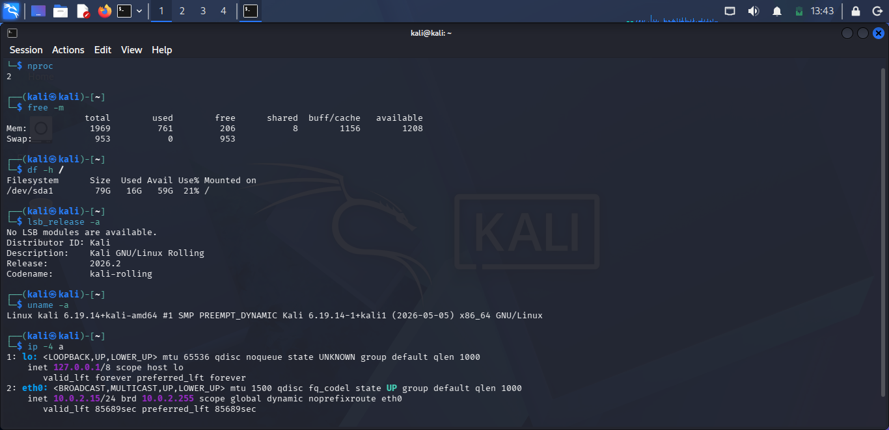

# Day 3: Hypervisor & Kali Linux Setup

## Environment Specs
* **OS:** Kali Linux Rolling 2026.2 (x86_64) on VirtualBox
* **Resources:** 2 vCPUs | 2 GB RAM | 80 GB Storage
* **Network:** NAT (`10.0.2.15/24`)

## Verification Commands
```bash
nproc
free -m
df -h /
lsb_release -a
uname -a
ip -4 a
```
## Evidence

