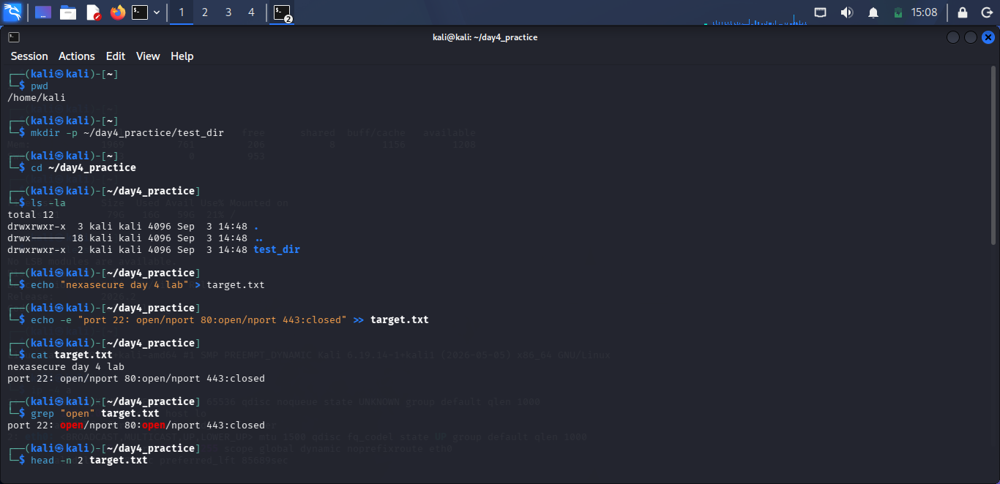
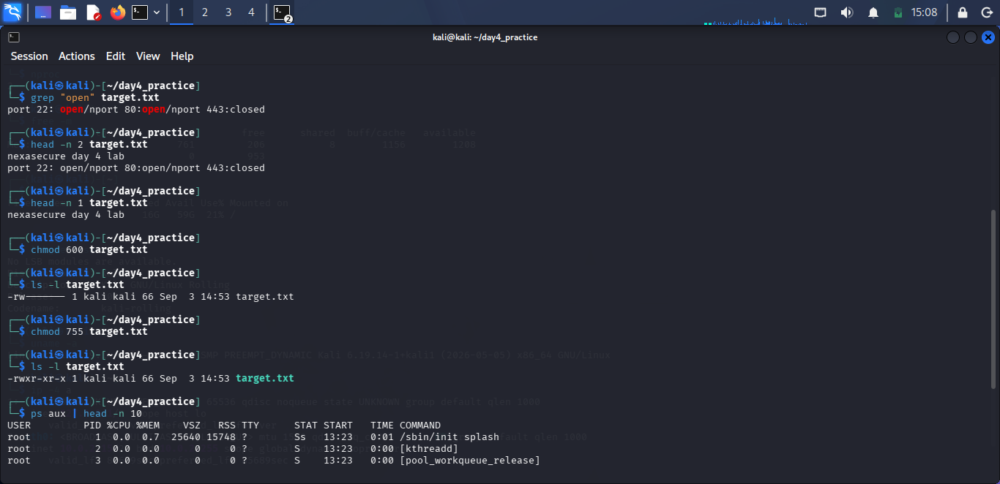
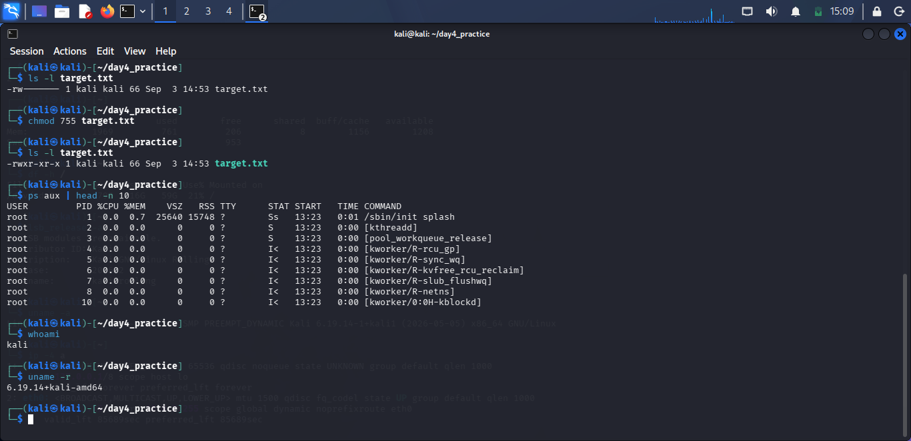

# Day 4: Linux Command Line Practice

## Summary
Practiced Linux terminal usage covering navigation, file creation, pattern searching, file permissions (`600`/`755`), and process monitoring.

## Command Execution Log
```bash
# Directory Navigation & Workspace
pwd
mkdir -p ~/day4_practice/test_dir
cd ~/day4_practice
ls -la

# File Operations & Text Processing
echo "nexasecure day 4 lab" > target.txt
echo -e "port 22: open\nport 80:open\nport 443:closed" >> target.txt
cat target.txt
grep "open" target.txt
head -n 2 target.txt
head -n 1 target.txt

# File Permissions & Security Controls
chmod 600 target.txt
ls -l target.txt
chmod 755 target.txt
ls -l target.txt

# System & Process Inspection
ps aux | head -n 10
```
## Evidence



whoami
uname -r
